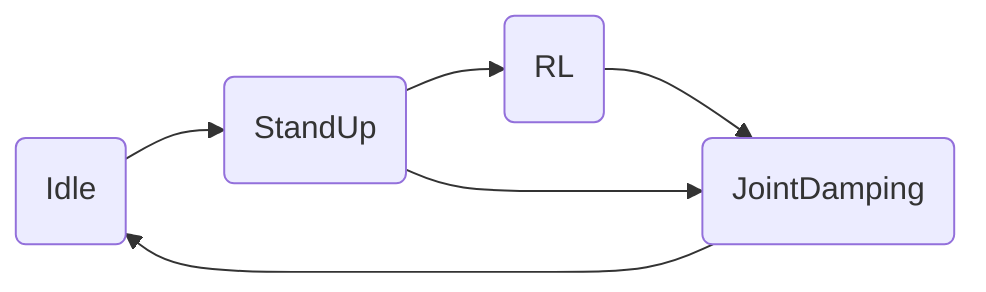
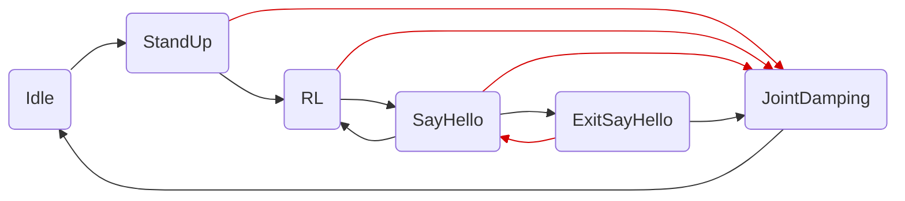
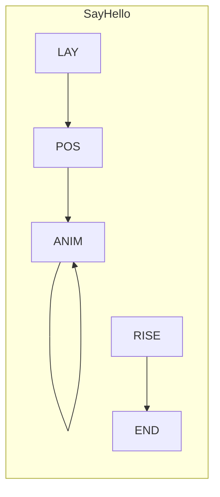
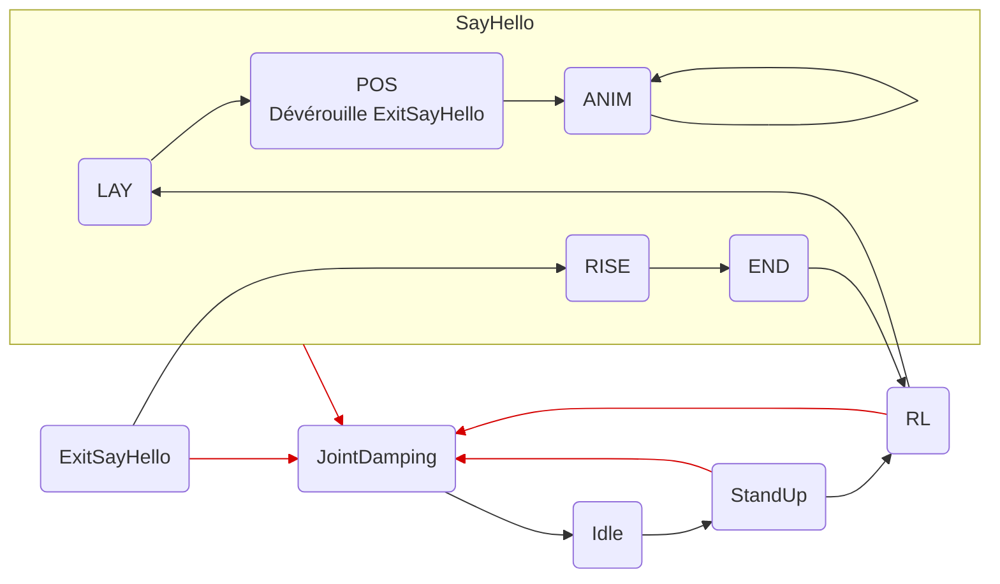

# Lite3 RL Deploy

Ce repo est un fork du repo originel de DeepRobotics. Il est ici pour expliquer en français et clarifier la mise en place du déploiement en simulation (sim-to-sim) ou en réel (sim-to-real) pour mon stage.

Leur série de vidéos sur [YouTube](https://youtube.com/playlist?list=PLy9YHJvMnjO0X4tx_NTWugTUMJXUrOgFH&si=pjUGF5PbFf3tGLFz) réalisé par Deep Robotics m'a beaucoup aidé pour comprendre comment leur environnement fonctionne, je vous conseille d'aller y jeter un oeil.

Ce repo est principalement orienté vers le déploiement de mouvements réalisés en Reinforcement Learning grâce au repo suivant : https://github.com/Rav3nPho3nix/rl_training.

Cependant il est possible d'utiliser ce repo afin que le robot réalise une actions 'hard codée', c'est à dire que le robot doit simplement faire selon le temps des mouvements qui seront toujours identiques.
Ceci passe par des modifications de la [machine à états](#machine-à-états-et-sous-états) afin de prendre en compte ce genre d'actions.

# Sommaire

- [Description](#description)
- [Installation](#installation)
- [Sim-to-Sim](#sim-to-sim)
- [Sim-to-Real]()

# Description

## Mes ajouts

J'ai réalisé pour mon stage 3 actions :
- Dire bonjour (action perdue depuis une mise à jour précédente, s'exécute indéfiniment)
- Saut vers l'avant (même chose mais je n'ai pas réussi à faire proprement attérir le robot, il n'a donc pas été déployé en simulation ou en réel dans ce repo)
- Se mettre en équilibre sur les pattes arrières (EN COURS)

'Dire bonjour' est un mouvement 'hard codée' car il ne nécessite pas (ou très peu) de prendre en compte son environnement.

Le 'saut vers l'avant' a été longtemps entrainé mais je n'ai pas obtenu de résultat concluant. Son code est présent dans le repo [rl_training](https://github.com/Rav3nPho3nix/rl_training) mais n'a pas été déployé.

'Se mettre en équilibre' [EN COURS]

## Contrôle des joints du Lite3

Les joints du robot sont stockés dans une tableau de 12 cases, chacune case étant la valeur d'un joint du robot.

Voici un tableau qui montre les indices de chaque joint par rapport à la patte auquel il appartient :

| Patte          | Hanche X | Hanche Y | Genoux |
|----------------|----------|----------|--------|
| Avant gauche   | 0        | 1        | 2      |
| Avant droite   | 3        | 4        | 5      |
| Arrière gauche | 6        | 7        | 8      |
| Arrière droite | 9        | 10       | 11     |

Si `tab` est le tableau des 12 joints, alors `tab[8]` est la valeur du joint du genoux de la patte arrière gauche.

Les joints possèdent les limites suivantes :

|                | Hanche X | Hanche Y | Genoux |
|----------------|----------|----------|--------|
| Limite basse   | -0.530   | -3.50    | 0.349  |
| Limite haute   | 0.530    | 0.320    | 2.80   |

<em>Toutes les limites sont disponibles dans [ce fichier](/state_machine/parameters/lite3_control_parameters.cpp).</em>

## Machine à états & sous-états

Ce programme se base sur une machine à états afin de spécifier quel action le robot doit faire.

Voici le graphe de la machine à états originel :

Et il contient les états suivants :
- Idle : Ne fait rien
- StandUp : Le robot se lève, en attente d'action
- RL (Reinforcement Learning) : Le robot entre dans les phases entrainées par IA, il peut alors réagir à son environnement et se déplacer en conséquences
- JointDamping : La sécurité du robot. Si les capteurs embarqués détectent des valeurs dangereuses, le robot relache tout les joints pour éviter la casse

Voici le graphe mis à jour avec les états supplémentaires permettant de lancer le 'dire bonjour' :



Les nouveaux états sont les suivants :
- SayHello : état de 'dire bonjour' qui le fait indéfiniment tant que l'utilisateur ne l'arrête pas
- ExitSayHello : état passager qui initie la sortie de 'Say Hello' pour plus tard repasser à 'RL'

On remarque des relations complexes entre 'RL', 'SayHello' et 'ExitSayHello'. C'est normal car 'SayHello' est plus complexe qu'un simple état. Je dis donc découper 'SayHello' en plusieurs sous-états qui eux-mêmes intéragissent avec des sous-états ou des états externes.

Voici le graphe des sous-etats de 'SayHello' :



Que l'on peut ensuite connecter aux autres états :



'SayHello' se fait en plusieurs étapes :
- LAY : Le robot se met sur le ventre afin d'être en position 'neutre' par rapport à l'état précédent
- POS : Le robot se met en position pour l'animation & Déverouille 'ExitSayHello' pour permettre de sortir de 'SayHello'<br>
<em>Si on autorise l'utilisateur à sortir de 'SayHello' brutalement pendant que le robot se couche sur le ventre ou est couché, le robot voudra rapidement se relever et cela le fera sauter</em>
- ANIM : Le robot réalise son animation
- RISE : Le robot se relève afin de sortir de 'SayHello' en sécurité<br>
<em>Lorsque l'utilisateur appuie sur le bouton pour sortir de 'SayHello', l'état 'éphémère' 'ExitSayHello' est appellé (à condition qu'il soit dévérouillé), qui lui-même donne la main à 'RISE' pour forcer la remontée du robot avant de rendre la main à 'RL'</em>
- END : Le robot a terminé sa remontée, il donne la main à 'RL'

Ce stratagème permet au robot d'entrer et de sortir de l'animation en toute sécurité.

# Installation
```bash
sudo apt-get install libdw-dev
wget https://raw.githubusercontent.com/bombela/backward-cpp/master/backward.hpp
sudo mv backward.hpp /usr/include

git clone --recurse-submodule https://github.com/Rav3nPho3nix/Lite3_rl_deploy.git
```

# Sim-to-Sim

Le déploiement Sim-to-Sim se fait via 2 applications :
- [Simulation 3d](#simulation-3d) : PyBullet ou MuJoco
- [Interface de contrôle](#interface-de-contrôle) : utilisation du clavier
Cela nécessite 2 terminaux.

## Dépendances
```bash
pip install pybullet "numpy < 2.0" mujoco
```

## Simulation 3d
Utilisez PyBullet ou MuJoco au choix :
```
# PyBullet
cd interface/robot/simulation
python pybullet_simulation.py

# MuJoco
cd interface/robot/simulation
python mujoco_simulation.py
```

## Interface de contrôle

### Compilation
```bash
mkdir build
cd build
cmake .. -DBUILD_PLATFORM=x86 -DBUILD_SIM=ON -DSEND_REMOTE=OFF
make -j
```

### Lancement
```bash
./rl_deploy
```
### Utilisation

#### Actions :

* r : mise en sécurité

Mode 'Idle' :
* z : se relever

Mode 'StandUp' :
* c : passage en mode 'RL'

Mode 'RL' :
* zqsd : déplacement en mode 'RL'
* h : passage en 'SayHello'

Mode 'SayHello' :
* h : passage en 'RL'

# Sim-to-Real

## Interface de contrôle

### Compilation

### Lancement

### Utilisation

Pour clavier : voir dans la [section précédente](#actions-)

Pour manette retroid :

* Appui joystick droit ET joystick gauche EN MEME TEMPS : Mise en sécurité

Mode 'Idle' :
* y : se relever

Mode 'StandUp' :
* a : passage en mode 'RL'

Mode 'RL' :
* joysticks : déplacements
* x : passage en 'SayHello'

Mode 'SayHello' :
* x : passage en mode 'RL'
