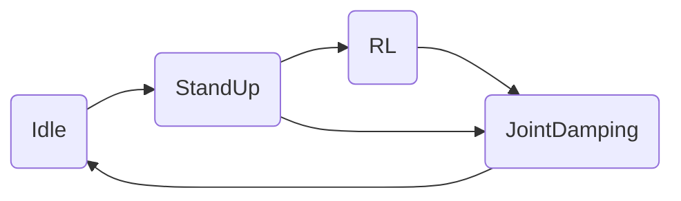
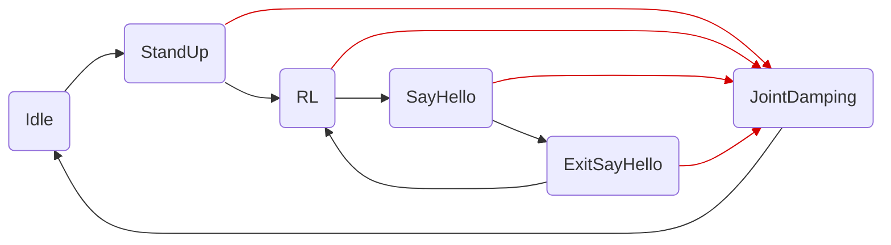

# Lite3 RL Deploy

Ce repo est un fork du repo originel de DeepRobotics. Il est ici pour expliquer en français et clarifier la mise en place du déploiement en simulation (sim-to-sim) ou en réel (sim-to-real) pour mon stage.

Leur série de vidéos sur [YouTube](https://youtube.com/playlist?list=PLy9YHJvMnjO0X4tx_NTWugTUMJXUrOgFH&si=pjUGF5PbFf3tGLFz) réalisé par Deep Robotics m'a beaucoup aidé pour comprendre comment leur environnement fonctionne, je vous conseille d'aller y jeter un oeil.

Ce repo est principalement orienté vers le déploiement de mouvements réalisés en Reinforcement Learning grâce au repo suivant : https://github.com/Rav3nPho3nix/rl_training.

Cependant il est possible d'utiliser ce repo afin que le robot réalise une actions 'hard codée', c'est à dire que le robot doit simplement faire selon le temps des mouvements qui seront toujours identiques.
Ceci passe par une légère modification de la [machine à états](#machine-à-états) afin de prendre en compte ce genre d'actions.

## Mes ajouts

J'ai réalisé pour mon stage 3 actions :
- Dire bonjour (action perdue depuis une mise à jour précédente, s'exécute indéfiniment)
- Saut vers l'avant (même chose mais je n'ai pas réussi à faire proprement attérir le robot, il n'a donc pas été déployé en simulation ou en réel dans ce repo)
- Se mettre en équilibre sur les pattes arrières (EN COURS)

'Dire bonjour' est un mouvement 'hard codée' car il ne nécessite pas (ou très peu) de prendre en compte son environnement.

Le 'saut vers l'avant' a été longtemps entrainé mais je n'ai pas obtenu de résultat concluant. Son code est présent dans le repo [rl_training](https://github.com/Rav3nPho3nix/rl_training) mais n'a pas été déployé.

'Se mettre en équilibre' [EN COURS]

## Fonctionnement général des joints du Lite3

Les joints du robot sont stockés dans une tableau de 12 cases, chacune case étant la valeur d'un joint du robot.

Voici un tableau qui montre les indices de chaque joint par rapport à la patte auquel il appartient :

| Patte          | Hanche X | Hanche Y | Genoux |
|----------------|----------|----------|--------|
| Avant gauche   | 0        | 1        | 2      |
| Avant droite   | 3        | 4        | 5      |
| Arrière gauche | 6        | 7        | 8      |
| Arrière droite | 9        | 10       | 11     |

Si `tab` est le tableau des 12 joints, alors `tab[8]` est la valeur du joint du genoux de la patte arrière gauche.

Les joints possèdent les limites suivantes :

|                | Hanche X | Hanche Y | Genoux |
|----------------|----------|----------|--------|
| Limite basse   | -0.530   | -3.50    | 0.349  |
| Limite haute   | 0.530    | 0.320    | 2.80   |

<em>Toutes les limites sont disponibles dans [ce fichier](/state_machine/parameters/lite3_control_parameters.cpp).</em>

## Machine à états

Ce programme se base sur une machine à états afin de spécifier quel action le robot doit faire.

Voici le graphe de la machine à états originel :

Et il contient les états suivants :
- Idle : Ne fait rien
- StandUp : Le robot se lève, en attente d'action
- RL (Reinforcement Learning) : Le robot entre dans les phases entrainées par IA, il peut alors réagir à son environnement et se déplacer en conséquences
- JointDamping : La sécurité du robot. Si les capteurs embarqués détectent des valeurs dangereuses, le robot relache tout les joints pour éviter la casse

Voici le graphe mis à jour avec les états supplémentaires permettant de lancer le 'dire bonjour' :

Les nouveaux états sont les suivants :
- SayHello : état de 'dire bonjour' qui le fait indéfiniment tant que l'utilisateur ne l'arrête pas
- ExitSayHello : état passager qui quitte 'dire bonjour' et redonne la main à l'état 'RL'
